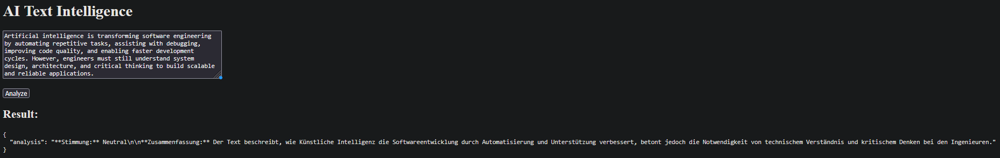

# AI Text Intelligence

A production-ready AI-powered text analysis application built with FastAPI, OpenAI, and deployed to the cloud.

This project focuses on backend architecture, API design, real-world deployment, and frontend-backend integration.

🔗 Live Demo: https://ai-text-intelligence-iiwe.onrender.com/  
📄 API Documentation: https://ai-text-intelligence-iiwe.onrender.com/docs

---

## Preview



---

## Overview

AI Text Intelligence is a full-stack web application that analyzes text using OpenAI models and stores the results persistently in a SQLite database.

The project demonstrates practical backend engineering skills including REST API design, service-layer architecture, database integration, cloud deployment, and debugging production issues.

---

## Architecture

The application follows a clean layered structure:

Client (HTML + JavaScript)  
↓  
FastAPI Routes (`main.py`)  
↓  
Service Layer (`analyzer.py`)  
↓  
Database Layer (`database.py`)  
↓  
SQLite

### Design Principles

- Separation of concerns
- Service-layer architecture
- RESTful API design
- Environment-based configuration
- Production deployment setup

---

## Tech Stack

- Python 3.11
- FastAPI
- OpenAI API
- SQLite
- Uvicorn
- HTML + JavaScript (Fetch API)
- Render (Cloud Deployment)

---

## Features

- AI-powered text analysis
- Persistent storage of analyses
- REST API endpoints:
  - `POST /analyze`
  - `GET /analyses`
  - `GET /analyses/{analysis_id}`
- Interactive Swagger documentation
- Cloud deployment with automatic redeploy on push

---

## Example API Usage

### POST /analyze

Request:

```json
{
  "text": "Artificial intelligence is transforming software engineering."
}
```

Response:

```json
{
  "analysis": "The text discusses the impact of AI on software development..."
}
```

---

## Local Setup

Clone the repository:

```bash
git clone https://github.com/abdullahdel/ai-text-intelligence.git
cd ai-text-intelligence
```

Create virtual environment:

```bash
python -m venv .venv
```

Activate environment:

Windows:
```bash
.venv\Scripts\activate
```

macOS / Linux:
```bash
source .venv/bin/activate
```

Install dependencies:

```bash
pip install -r requirements.txt
```

Create a `.env` file in the project root:

```
OPENAI_API_KEY=your_api_key_here
```

Run locally:

```bash
uvicorn app.main:app --reload
```

---

## Deployment

The application is deployed on Render with:

- Environment variable configuration
- Production start command
- Automatic rebuild on push to `master`
- Debugged production issues (dependency mismatches, URL configuration, CORS behavior)

Live URL:  
https://ai-text-intelligence-iiwe.onrender.com/

---

## Engineering Reflection

During development and deployment, several real-world challenges were addressed:

- Resolving production URL mismatches between local and cloud environments
- Debugging failed deployments due to missing dependencies
- Managing environment variables securely in production
- Handling frontend-backend communication over HTTPS
- Understanding and resolving build pipeline issues

This project reflects hands-on backend engineering experience beyond tutorial-level implementation.

---

## What This Project Demonstrates

- Backend API development with FastAPI
- Integration of external AI services
- Database persistence
- Clean project structure
- Cloud deployment workflow
- Production debugging and problem-solving

---

## Author

**Abdullah Talal**  
Informatics Student – LMU Munich  
Focus: Backend Engineering & AI Systems